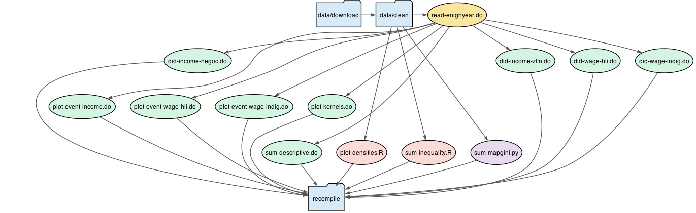

# Carrasco & Ortega — Minimum Wage and Indigenous Workers in Mexico

Replication package for the analysis of the 2019 ZLFN minimum-wage increase on indigenous and non-indigenous workers using ENIGH cross-sections (2016–2024).

## Task dependency graph




## Folder structure

```
CarrascoOrtega-minwage/
├── Makefile
├── generic.make
├── pyproject.toml
├── README.md
├── data/
│   ├── download/
│   │   ├── code/
│   │   └── output/
│   └── clean/
│       ├── code/
│       ├── input/
│       └── output/
├── estimate/
│   ├── code/
│   │   └── log/
│   ├── input/
│   └── output/
│       └── figs/
└── recompile/
    ├── Makefile
    └── code/
```

Each task folder follows `code/ → input/ → output/`.
`generic.make` auto-builds upstream outputs when an input is missing.

### File naming conventions

| Prefix  | Category              | Example                  |
|---------|-----------------------|--------------------------|
| `sum-`  | Summary / descriptive | `sum-descriptive.do`     |
| `did-`  | Diff-in-diff tables   | `did-wage-hli.do`        |
| `plot-` | Figures               | `plot-event-income.do`   |

In **data/**, the prefix is the dataset name (`enigh-`, `inpc-`).
In **estimate/**, the prefix is the output category.

## Software requirements

| Tool       | Version tested  | Purpose                          |
|------------|-----------------|----------------------------------|
| Stata MP   | StataNow 19.5   | Regressions, tables, Stata figs  |
| R          | 4.5.2           | Inequality measures, densities   |
| Python     | ≥ 3.10 (via uv) | Mexico Gini map                  |
| GNU Make   | 3.81+           | Build orchestration              |
| wget       | any             | Data downloads                   |

### Install R (macOS / Homebrew)

```bash
brew install --cask r
```

R packages are auto-installed on first run via `pacman::p_load()`.
Before the first run, install `pacman` and set a CRAN mirror:

```bash
Rscript -e 'options(repos = c(CRAN = "https://cloud.r-project.org")); install.packages("pacman")'
echo 'options(repos = c(CRAN = "https://cloud.r-project.org"))' >> ~/.Rprofile
```

### Install Python dependencies (uv)

```bash
brew install uv
uv sync
```

### Stata path setup

```bash
# Add to ~/.zshrc
export PATH="/Applications/StataNow/StataMP.app/Contents/MacOS:$PATH"
source ~/.zshrc
```

### Other tools

```bash
brew install wget
```

## Replication

```bash
make
```

Pipeline: `data/download/code` → `data/clean/code` → `estimate/code`.
To run a single stage, `cd` into its `code/` directory and run `make`.